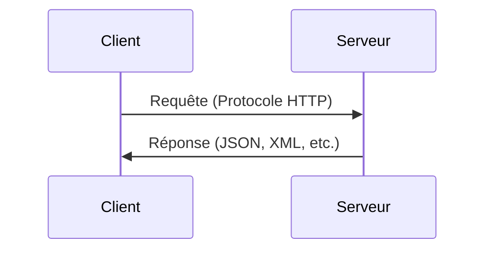

---
# You can also start simply with 'default'
theme: seriph
# random image from a curated Unsplash collection by Anthony
# like them? see https://unsplash.com/collections/94734566/slidev
# background: https://cover.sli.dev
background: /api_back.png
# some information about your slides (markdown enabled)
title: Tuto Web
info: |
  ## Slidev Starter Template
  Presentation slides for developers.

  Learn more at [Sli.dev](https://sli.dev)
# apply unocss classes to the current slide
class: text-center
# https://sli.dev/features/drawing
fonts:
  sans: 'Roboto'
drawings:
  persist: false
# slide transition: https://sli.dev/guide/animations.html#slide-transitions
transition: slide-left
# enable MDC Syntax: https://sli.dev/features/mdc
mdc: true
---

<h1 class="glass_container blue">Comprendre le Web</h1>

<h2 class="glass_container white">2- Fonctionnement d'une API</h2>

<!--
The last comment block of each slide will be treated as slide notes. It will be visible and editable in Presenter Mode along with the slide. [Read more in the docs](https://sli.dev/guide/syntax.html#notes)
-->
<style>

.glass_container {
  background-color: rgba(255, 255, 255, 0.3);
  backdrop-filter: blur(40px);
  border-radius: 20px;
  text-transform: uppercase;
  display: flex;
  flex-direction: column;
  justify-content: center;
  align-items: center;
  padding: 30px 30px;
  font-weight: bold;
}

.glass_container.blue {
      background-color: #1b73babb;
      /* border-top-right-radius: 0px; */
      padding: 30px 30px;
      font-weight: bold;
  }
</style>
---
layout: two-cols-header
---

# Qu'est ce q'une API ?

**API** = **A**pplication **P**rogramming **I**nterface = Interface de programmation Applicative

<div v-click>
  Permet de se connecter à des méthodes / données d’un système applicatif (= une application)

  Une interface normalisée pour échanger des données entre des programmes
</div>
<div v-click>

  ## Deux types d'API
  <br>
</div>

::left::
<div v-click style="padding-right: 5px;">

  - **API "Intégrée" (SDK)** : ***S**oftware **D**evelopment **K**it*

API accessible via une librairie (bibliothèque) spécifique dans un langage de programmation spécifique.

Exemple : l’API de Google Sheets dans Apps Script : SpreadsheetsApp utilise le SDK de Google
```js
var ss = SpreadsheetApp.getActiveSpreadsheet();
```

</div>

::right::
<div v-click style="padding-left: 5px;">

  - **API REST** : ***R**epresentational **S**tate **T**ransfer*

  API accessible publiquement via le protocole HTTP (système de requête / réponse) et normée par l’architecture REST (REpresentational State Transfer)

  Exemple : Requête HTTP vers une API REST
  ```js
  var res = fetch("https://api.example.com/data");
  ```

</div>

<!--  Les APIs "Intégrées" sont généralement plus simples à mettre en place et à utiliser. -->

---
layout: two-cols
---

<div v-click style="padding-right: 5px;">

  - **API Intégrée (SDK)** : ***S**oftware **D**evelopment **K**it*

API accessible via une librairie (bibliothèque) spécifique dans un langage de programmation spécifique.

✅ Avantages

Permet de se connecter facilement à un système externe et de manipuler les données / méthodes rapidement

❌ Inconvénients

Nécessite d’installer une librairie spécifique selon le langage de programmation (il faut que cette librairie existe pour ce langage)

</div>

::right::
<div v-click style="padding-left: 5px;">

  - **API REST** : ***R**epresentational **S**tate **T**ransfer*

  API accessible publiquement via le protocole HTTP (système de requête / réponse) et normée par l’architecture REST (REpresentational State Transfer)

✅ Avantages

Peut être utiliser par n’importe quel service qui fait des requêtes HTTP : Méthodes universelles

❌ Inconvénients

Beaucoup plus verbeux et nécessite souvent plus de code pour être mise en place.

</div>

---
transition: slide-up
---

# API Rest
Ici nous allons nous concentrer sur les APIs externes qui permettent de se connecter à n’importe quelle application qui propose une API via le protocole HTTP (méthode universelle qui fonctionne partout).

<div v-click style="width: 100%; display: flex; justify-content: center;">

</div>

<div v-click >

## Renvoie des données structurées
- JSON (**J**ava**S**cript **O**bject **N**otation)
- XML (e**X**tensible **M**arkup **L**anguage)
- CSV (**C**omma **S**eparated **V**alues)

Ces données sont plus faciles à lire et à analyser pour un programme et sont normalisées pour être utilisées par tous les langages de programmation.
</div>

<!--  La plupart des APIs REST renvoient des données au formatJSON. -->

---
transition: slide-up
---

# Comment se connecter à une API ?
Une API Rest (HTTP) est un protocole qui fonctionne sur une architecture Client / Serveur.

L’objectif ? La plupart du temps pour faire du **CRUD**

<br>

<div v-click >

| CRUD            | Action | Verbe HTTP  |
| --------------- | ------------- | ------------|
| **C**reate      | Créer         | <span class="chip green">**POST**</span>        |
| **R**ead        | Lire          | <span class="chip blue">**GET**</span>         |
| **U**pdate      | Mettre à jour | <span class="chip orange">**PUT / PATCH**</span> |
| **D**elete      | Supprimer     | <span class="chip red">**DELETE**</span>      |
</div>

<style>

.chip {
  padding: 5px 10px;
  border-radius: 5px;
  color: white;
}

.chip.green {
  background-color: #49cc90;
}

.chip.blue {
  background-color: #61affe;
}

.chip.orange {
  background-color: #fca130;
}

.chip.red {
  background-color: #f93e3e;
}

</style>

<!--
Le CRUD est une convention pour les opérations de base sur une ressource. Ce sont toutes les opérations que l'on peut faire sur des données.
-->

---
---

# Anatomie d'une requête HTTP

<div v-click >

| Paramètre             | Valeurs possibles |
| --------------------- | ----------------- |
| Méthode (Protocole)   | <span class="chip blue">**GET**</span> <span class="chip green">**POST**</span> <span class="chip orange">**PUT / PATCH**</span> <span class="chip red">**DELETE**</span> |
| URL (endpoint)        | Point de terminaison : https://api.example.com/users |
| Paramètres de la requête (query) | ?limit=2&filter=all |
| Headers                | ``` {"Content-Type": "application/json"}``` |
| Payload (Charge utile) | ``` {"name": "John", "age": 30}``` |

</div>

<div v-click >
<br>

Paramètres de la requête (query) : Utilisés pour les <span class="chip blue">**GET**</span> (limiter les résultats, faire de la pagination, etc.)

Payload (Charge utile) : Utilisé pour les <span class="chip green">**POST**</span> <span class="chip orange">**PUT / PATCH**</span> (Informations à modifier)

</div>

<style>

.chip {
  padding: 5px 10px;
  border-radius: 5px;
  color: white;
}

.chip.green {
  background-color: #49cc90;
}

.chip.blue {
  background-color: #61affe;
}

.chip.orange {
  background-color: #fca130;
}

.chip.red {
  background-color: #f93e3e;
}

</style>

<!-- Les protocoles sont normalisés par l'architecture REST. 
Les paramètres de la requête sont très souvent utilisés pour les GET (limiter les résultats, faire de la pagination, etc.)
Le payload est la charge utile de la requête. C'est ce qui est envoyé au serveur (rarement utilisé pour les GET)
-->

---
---

# Anatomie d'une réponse HTTP

<div v-click >

| Paramètre             | Valeurs possibles |
| --------------------- | ----------------- |
| Status Code       | Code d'état de la réponse |
| Headers                | ``` {"Content-Type": "application/json"}``` |
| Content (Contenu) | ``` {"name": "John", "age": 30}``` |

</div>

<div v-click style="width: 50%; margin: 0 auto; font-size: 14px;">

| Status Code | Description |
|------|-------------|
| <span class="chip green">**2XX**</span> | Réussite |
| <span class="chip blue">**3XX**</span> | Redirection |
| <span class="chip orange">**4XX**</span> | Erreur côté client |
| <span class="chip red">**5XX**</span> | Erreur côté serveur |

</div>

<style>

.chip {
  padding: 5px 10px;
  border-radius: 5px;
  color: white;
}

.chip.green {
  background-color: #49cc90;
}

.chip.blue {
  background-color: #61affe;
}

.chip.orange {
  background-color: #fca130;
}

.chip.red {
  background-color: #f93e3e;
}

</style>

<!--  Le status code est un code qui indique le résultat de la requête. Une API ne doit pas renvoyer un status code 200 si la requête n'a pas été exécutée correctement.
(Certaines APIs renvoient un status code 200 même si la requète n'a pas été exécutée correctement, c'est une mauvaise pratique et ça ne respecte pas la norme REST) -->

---
layout: two-cols-header
---

# Exemple de requête : Récupérer les utilisateurs

::left::
<div v-click style="padding-right: 10px; font-size: 14px;">

## Requête

<br>
<br>

| Paramètre             | Valeur |
| --------------------- | ----------------- |
| Protocole   | <span class="chip blue">**GET**</span> |
| URL (endpoint)        | https://api.example.com/users |
| Paramètres | ?limit=2&filter=all |
| Headers                | ``` {"Content-Type": "application/json"}``` |
| Payload | *Pas de Payload* |

</div>


::right::
<div v-click style="padding-left: 10px;">

## Réponse 

- Status Code : <span class="chip green">**200 OK**</span>

<br>

- Contenu (JSON) :

```json
[
  { 
    "id": 1, 
    "name": "John Doe", 
    "email": "john.doe@example.com" 
  },
  { 
    "id": 2, 
    "name": "Jane Smith", 
    "email": "jane.smith@example.com"
  }
]
```
</div>

<style>

.chip {
  padding: 5px 10px;
  border-radius: 5px;
  color: white;
}

.chip.green {
  background-color: #49cc90;
}

.chip.blue {
  background-color: #61affe;
}

</style>

<!-- Un GET sur une ressource globale renvoie très souvent une liste de ressources. -->

---
layout: two-cols-header
---

# Exemple de requête : Récupérer un utilisateur précis

::left::
<div v-click style="padding-right: 10px; font-size: 14px;">

## Requête

<br>

| Paramètre             | Valeur |
| --------------------- | ----------------- |
| Protocole   | <span class="chip blue">**GET**</span> |
| URL (endpoint)        | https://api.example.com/users/1 |
| Paramètres | *Pas de paramètres*|
| Headers                | ``` {"Content-Type": "application/json"}``` |
| Payload | *Pas de Payload* |

</div>


::right::
<div v-click style="padding-left: 10px;">

## Réponse
<br>

- Status Code : <span class="chip green">**200 OK**</span>

<br>

- Contenu (JSON) :

```json
{ 
  "id": 1, 
  "name": "John Doe", 
  "email": "john.doe@example.com" 
}
```
</div>

<style>

.chip {
  padding: 5px 10px;
  border-radius: 5px;
  color: white;
}

.chip.green {
  background-color: #49cc90;
}

.chip.blue {
  background-color: #61affe;
}

</style>

<!--  Un GET sur une ressource spécifique renvoie une seule ressource. (et souvent des champs supplémentaires pour cette ressource) -->

---
layout: two-cols-header
---

# Exemple de requête : Créer un utilisateur

::left::
<div v-click style="padding-right: 10px; font-size: 14px;">

## Requête

<br>

| Paramètre             | Valeur |
| --------------------- | ----------------- |
| Protocole   | <span class="chip green">**POST**</span> |
| URL (endpoint)        | https://api.example.com/users |
| Paramètres | *Pas de paramètres* |
| Headers                | ``` {"Content-Type": "application/json"}``` |
| Payload | ``` {"name": "Martin Pierre", "email": "martin.pierre@mail.com"}``` |

</div>


::right::
<div v-click style="padding-left: 10px;">

## Réponse
<br>

- Status Code : <span class="chip green">**201 Created**</span>

<br>

- Contenu (JSON) :

```json
{ 
  "id": 3, 
  "name": "Martin Pierre", 
  "email": "martin.pierre@mail.com" 
}
```
</div>

<style>

.chip {
  padding: 5px 10px;
  border-radius: 5px;
  color: white;
}

.chip.green {
  background-color: #49cc90;
}

.chip.blue {
  background-color: #61affe;
}

</style>

---
---

# Principaux codes d'état HTTP <span class="chip green" style="color: white;">**2XX**</span> <span class="chip blue" style="color: white;">**3XX**</span>

<br>

<div v-click >

### <span class="chip green">**2XX**</span> : Réussite

| Code  | Message | Signification |
|------|-------------| ------------- |
| <span class="chip green">**200**</span> | OK | La requête a été exécutée avec succès |
| <span class="chip green">**201**</span> | Created| La ressource a été créée avec succès |


</div>

<br>

<div v-click >

### <span class="chip blue">**3XX**</span> : Redirections

| Code  | Message | Signification |
|------|-------------| ------------- |
| <span class="chip blue">**301**</span> | Moved Permanently | La ressource a été déplacée de façon permanente |
| <span class="chip blue">**302**</span> | Found| La ressource a été déplacée de façon temporaire |


</div>

<style>

.chip {
  padding: 5px 10px;
  border-radius: 5px;
  color: white;
}

.chip.green {
  background-color: #49cc90;
}

.chip.blue {
  background-color: #61affe;
}

.chip.orange {
  background-color: #fca130;
}

.chip.red {
  background-color: #f93e3e;
}

</style>

---
---

# Principaux codes d'état HTTP <span class="chip orange" style="color: white;">**4XX**</span>

<br>

<div v-click >

### <span class="chip orange">**4XX**</span> : Erreur côté client

<br>

| Code  | Message | Signification |
|------|-------------| ------------- |
| <span class="chip orange">**400**</span> | Bad Request | La requête est invalide |
| <span class="chip orange">**401**</span> | Unauthorized| La requête n'est pas autorisée (vous devez être authentifié) |
| <span class="chip orange">**403**</span> | Forbidden| Vous n'avez pas les droits pour accéder à la ressource |
| <span class="chip orange">**404**</span> | Not Found| La ressource demandée n'existe pas |

</div>

<style>

.chip {
  padding: 5px 10px;
  border-radius: 5px;
  color: white;
}

.chip.orange {
  background-color: #fca130;
}


</style>

---
---

# Principaux codes d'état HTTP <span class="chip red" style="color: white;">**5XX**</span>

<br>

<div v-click >

### <span class="chip red">**5XX**</span> : Erreur côté serveur

<br>

| Code  | Message | Signification |
|------|-------------| ------------- |
| <span class="chip red">**500**</span> | Internal Server Error | Le serveur a rencontré une erreur interne (bug côté serveur) |
| <span class="chip red">**503**</span> | Service Unavailable| Le service demandé n'est pas disponible |

</div>

<div v-click >

<br>

## Tous les codes d'état HTTP

Liste de tous les codes d'état HTTP :

<a href="https://developer.mozilla.org/fr/docs/Web/HTTP/Status" target="_blank">https://developer.mozilla.org/fr/docs/Web/HTTP/Status</a>

</div>


<style>

.chip {
  padding: 5px 10px;
  border-radius: 5px;
  color: white;
}

.chip.red {
  background-color: #f93e3e;
}

</style>

---
---

# Exemple concret : Requête à l'API de Geoapify

<div v-click style="padding-right: 10px; font-size: 14px;">

<!-- ## Requête -->

<br>

| Protocole   | <span class="chip blue">**GET**</span> |
|-------------|----------------------------------------|
| URL (endpoint)        | https://api.geoapify.com/v1/geocode/search |
| Paramètres | ?text=Restaurant%20Rennes%2C%20France&limit=5&apiKey=ba33e5e67a67487b9ab043b1a25745a3|

</div>

<br>

<div v-click style="padding-left: 10px;">

<!-- ## Code -->

```js
  var baseUrl = 'https://api.geoapify.com/v1/geocode/search';

  var query = 'Restaurant Rennes, France';

  var apiKey = 'ba33e5e67a67487b9ab043b1a25745a3'; // Remplacez par votre clé API Geoapify

  // Construire l'URL de la requête (en remplaçant les caractères spéciaux par leur code URL)
  var url = baseUrl + '?text=' + encodeURIComponent(query) + '&limit=5&apiKey=' + apiKey;

  // Faire la requête à l'API Geoapify
  var response = UrlFetchApp.fetch(url);
```

</div>

<style>

.chip {
  padding: 5px 10px;
  border-radius: 5px;
  color: white;
}

.chip.green {
  background-color: #49cc90;
}

.chip.blue {
  background-color: #61affe;
}

</style>

---
---

# Exemple concret : Réponse de l'API de Geoapify

<div v-click style="padding-right: 10px; font-size: 14px;">

<br>

Status Code : <span class="chip green">**200 OK**</span>

</div>

<div v-click>

Contenu (JSON) :

```json
[
  {"name"="Ethiopian Restaurant", "lat"=48.1169962, "lon"=-1.6809269, "address"="Ethiopian Restaurant,29 Rue de Saint-Malo, 35000 Rennes, France"},
  {"name"="IKEA Restaurant", "lat"=48.1371551, "lon"=-1.7629355, "address"="IKEA Restaurant,14 Avenue des Touches, 35740 Pacé, France"},
  {"name"="Le Bistro du Pêcheur", "lat"=48.1371551, "lon"=-1.7629355, "address"="Le Bistro du Pêcheur,14 Avenue des Touches, 35740 Pacé, France"},
  {"name"="Restaurant Ouest-France", "lat"=48.094804100000005, "lon"=-1.626805200114838, "address"="Restaurant Ouest-France,Rue du Breil, 35135 Chantepie, France"},
  {"name"="Restaurant universitaire La Harpe", "lat"=48.12420135, "lon"=-1.7083268293414917, "address"="Restaurant universitaire La Harpe,Avenue Charles et Raymond Tillon, 35043 Rennes, France"}
]
        
```

</div>

<style>

.chip {
  padding: 5px 10px;
  border-radius: 5px;
  color: white;
}

.chip.green {
  background-color: #49cc90;
}

.chip.blue {
  background-color: #61affe;
}

</style>

<!-- - 🎨 **Themable** - themes can be shared and re-used as npm packages
- 🧑‍💻 **Developer Friendly** - code highlighting, live coding with autocompletion
- 🤹 **Interactive** - embed Vue components to enhance your expressions
- 🎥 **Recording** - built-in recording and camera view
- 📤 **Portable** - export to PDF, PPTX, PNGs, or even a hostable SPA
- 🛠 **Hackable** - virtually anything that's possible on a webpage is possible in Slidev -->

<!-- Read more about [Why Slidev?](https://sli.dev/guide/why) -->

<!--
You can have `style` tag in markdown to override the style for the current page.
Learn more: https://sli.dev/features/slide-scope-style
-->

---
---

# Les Applications Modernes et les APIs
### Tous les services No-Code consomment des APIs
<br>
<div v-click style="display: flex; justify-content: flex-start; gap: 30px;">


</div>

<br>
<div v-click>

### Possibilité de faire la même chose gratuitement

<br>

<div style="display: flex; justify-content: flex-start; gap: 30px;">


  </div>

<br>

### Combo Apps Script / Sheets (ou n'importe quelle langage de programmation)
</div>
<!--
Make, Zapier, n8n, sont tous des services de workflow qui permettent de faire des appels API et de les lier entre eux.
-->

---
---

# Sommaire

<Toc text-sm minDepth="1" maxDepth="2" />
